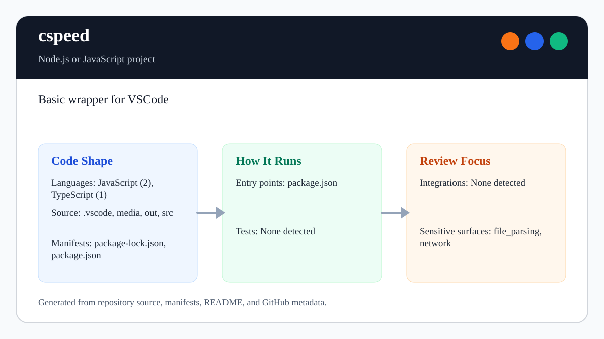

# cspeed

<!-- README-OVERVIEW-IMAGE -->


## Overview

`garethpaul/cspeed` is a minimal VS Code sidebar webview extension sample.

This README is based on the checked-in source, manifests, scripts, and repository metadata on the `main` branch. The project language mix found during review was: JavaScript (2), TypeScript (1).

## Repository Contents

- `README.md` - project overview and local usage notes
- `.github/workflows/check.yml` - GitHub Actions baseline for `make check`
- `package.json` - JavaScript dependency and script metadata
- `media` - source or example code
- `out` - source or example code
- `package-lock.json` - JavaScript dependency and script metadata
- `SECURITY.md` - security reporting and disclosure guidance
- `src` - source or example code
- `VISION.md` - project direction and maintenance guardrails

Additional scan context:

- Source directories: media, out, src
- Dependency and build manifests: package-lock.json, package.json
- Entry points or build surfaces: package.json
- Verification gate: `make check`

## Getting Started

### Prerequisites

- Git
- Node.js 22, matching `.nvmrc` (CI also verifies Node 24)
- npm

### Setup

```bash
git clone https://github.com/garethpaul/cspeed.git
cd cspeed
npm ci
```

The setup commands above are derived from repository files. Legacy mobile, Python, or JavaScript samples may require older SDKs or package versions than a modern workstation uses by default.

## Running or Using the Project

Open this repository in VS Code, create a local extension-host launch
configuration if needed, and run the sidebar webview extension against the
compiled `out/` output.

Detected npm scripts:

- `npm run compile` - `tsc -p ./`
- `npm run check:generated` - compile and reject drift in checked-in `out/` files
- `npm run check` - `scripts/check-baseline.sh`
- `npm run lint` - `eslint src --ext ts --max-warnings=0`
- `npm run test` - compile, run Node parser, dispatch, activation, and provider lifecycle tests, and run the source baseline
- `npm run verify` - lint, tests, generated-output verification, and dependency audit
- `npm run vscode:prepublish` - `npm run compile`
- `npm run watch` - `tsc -watch -p ./`

The development baseline pins ESLint 10.5.0, typescript-eslint 8.61.1, and
@types/node 22.19.21. TypeScript 6 and Node 25 remain separate compatibility
work; this repository continues to support its declared Node 22/24 and
TypeScript 5.9 contracts.

## Testing and Verification

Run the local gate before changing extension or webview behavior:

```bash
make check
make build
npm run verify
npm run lint
npm test
npm audit --audit-level=moderate
```

GitHub Actions runs `npm ci` and `make check` on pushes, pull requests, and
manual dispatches with Node 22 and 24 on Ubuntu 24.04. The workflow uses
commit-pinned actions, read-only repository access, a credential-free
checkout, and a bounded runtime.

`make check` runs the root lint, test, build, and audit gates. `make build`
runs `npm run check:generated`, which compiles TypeScript and fails when the
checked-in `out/` extension output differs from the generated result.
`npm test` compiles TypeScript, runs executable Node tests for accepted and
rejected alert messages, notification dispatch, extension registration, and
sidebar provider lifecycle behavior, and runs
`scripts/check-baseline.sh`. The source
baseline checks that the webview has a content security policy, nonce-scoped
script execution, base URI and form submissions disabled, bounded message
handling with non-empty normalized alert text, own alert message properties,
plain non-array objects, plain object prototypes, single-line alert
notifications, and synchronized compiled output. The script nonce is generated
with Node crypto instead of `Math.random`, and the webview script is loaded
from `media/main.js` through a scoped VS Code webview URI.
The message parser lives in `src/alertMessage.ts`, so its normalization and
rejection behavior can be tested without loading a VS Code extension host.
The notification boundary lives in `src/alertMessageHandler.ts`, so tests also
verify that only accepted messages produce one normalized notification.
The provider lives in `src/sidebarProvider.ts`, so deterministic tests also
verify media-only resource scoping, CSP-backed HTML, contributed-view
registration, and disposal of each message listener with its owning view.

When the required SDK or runtime is unavailable, use static checks and source review first, then verify on a machine that has the matching platform toolchain.

Use [`EXTENSION_HOST_VERIFICATION.md`](EXTENSION_HOST_VERIFICATION.md) to
record exact-head VS Code desktop and rendered sidebar evidence. Keep
unavailable integration scenarios as explicit unexecuted rows rather than
treating Node tests or compiled-output checks as Extension Host execution.

## Configuration and Secrets

- No required secret or credential file was identified in the repository scan. If you add integrations later, keep secrets out of git.

## Security and Privacy Notes

- Review changes touching network requests, sockets, or service endpoints; examples from the scan include package.json, src/extension.ts, media/main.js.
- Review changes touching file, media, JSON, XML, CSV, OCR, or data parsing; examples from the scan include media/main.js, package.json, src/extension.ts.

## Maintenance Notes

- The webview uses a crypto-generated CSP nonce and keeps checked-in compiled
  output synchronized with the TypeScript source.
- The webview CSP keeps base URI and form submissions disabled in addition to
  denying default resource loads.
- The sidebar webview script is loaded from `media/main.js` under the same
  nonce-scoped content security policy.
- Webview alert text is trimmed and bounded, while C0/C1 controls, Unicode line
  separators, Unicode bidirectional ordering controls, invisible Unicode format controls,
  and lone UTF-16 surrogates
  are rejected before the extension host displays it.
- Alert messages must provide own `command` and `text` properties before the
  extension host reads or displays them.
- Alert fields must be own data properties without invoking accessors, and
  reflection failures are rejected without escaping message dispatch.
- Alert messages must be plain non-array objects before field validation runs.
- Alert messages must use plain object prototypes before field validation runs.
- Alert dispatch tests require accepted messages to emit exactly one normalized
  notification and rejected messages to emit none.
- Sidebar provider tests require view-owned message subscriptions to be
  disposed when the corresponding webview is disposed.
- Root `make build` runs the TypeScript compiler directly before audit-backed
  verification.
- Local `.vscode/` workspace files are ignored so editor launch settings and
  recommendations stay machine-local.
- See `SECURITY.md` for vulnerability reporting and safe research guidance.
- See `VISION.md` for project direction and contribution guardrails.
- See `CHANGES.md` for maintenance history.
- See `docs/plans/2026-06-09-cspeed-make-build-gate.md` for the root build gate
  baseline.
- See `docs/plans/2026-06-09-cspeed-media-script-baseline.md` for the external
  webview script baseline.
- See `docs/plans/2026-06-09-cspeed-alert-own-properties.md` for the webview
  alert own-property validation baseline.
- See `docs/plans/2026-06-09-cspeed-alert-plain-object-validation.md` for the
  webview alert plain-object validation baseline.
- See `docs/plans/2026-06-09-cspeed-alert-object-prototype.md` for the webview
  alert object-prototype validation baseline.
- See `docs/plans/2026-06-09-cspeed-editor-metadata-ignore.md` for the local
  editor metadata ignore baseline.
- See `docs/plans/2026-06-09-cspeed-webview-csp-navigation.md` for webview CSP
  navigation restrictions.
- See `docs/plans/2026-06-10-ci-baseline.md` for the lightweight GitHub
  Actions baseline.
- See `docs/plans/2026-06-10-cspeed-alert-parser-tests.md` for executable
  webview message validation coverage.
- See `docs/plans/2026-06-12-cspeed-alert-dispatch-tests.md` for executable
  extension-host notification dispatch coverage.
- See `docs/plans/2026-06-13-cspeed-alert-bidi-controls.md` for the Unicode
  bidirectional ordering-control boundary.
- See `docs/plans/2026-06-15-cspeed-invisible-format-controls.md` for the
  invisible Unicode format-control boundary.
- See `docs/plans/2026-06-17-cspeed-invisible-operator-alerts.md` for the
  Unicode invisible operators notification boundary.
- See `docs/plans/2026-06-15-cspeed-alert-lone-surrogates.md` for the malformed
  UTF-16 alert boundary.

## Contributing

Keep changes small and tied to the project that is already present in this repository. For code changes, document the toolchain used, avoid committing generated dependency directories or local configuration, and update this README when setup or verification steps change.
